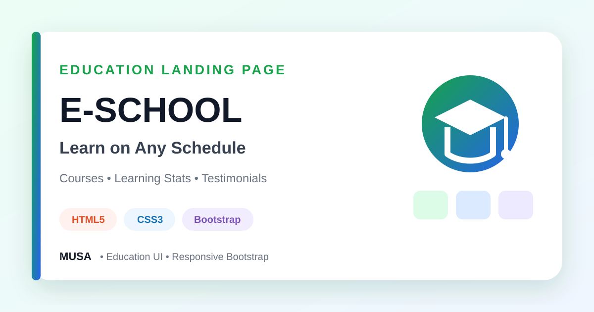

<div align="center">



# E-School — Responsive Education Landing Page

### A Bootstrap-based education website featuring course cards, learning statistics, testimonials, calls to action, and a responsive layout.


[](https://github.com/samusa099)
[](https://developer.mozilla.org/docs/Web/HTML)
[](https://developer.mozilla.org/docs/Web/CSS)
[](https://getbootstrap.com/)

[](https://github.com/samusa099/Assignments_08)
[](https://github.com/samusa099/Assignments_08)
[](https://github.com/samusa099/Assignments_08/commits/main)

</div>

---

## 📌 Overview

A responsive education landing page with course cards, feature statistics, learning information, testimonials, sign-in actions, and Bootstrap-based layout components.

## 📚 Documentation

| Resource | Description |
|---|---|
| [**HOW_TO_USE.md**](HOW_TO_USE.md) | Detailed explanation of why, where, and how to study, customise, extend, and deploy the project |
| [**Repository Cover**](assets/repository-cover.svg) | Scalable professional cover used in this README |

## ✨ Key Features

- Education-focused responsive hero
- Learning-statistics feature cards
- Online course catalogue cards
- Course dates and seat information
- Testimonial and footer sections
- Bootstrap grid and utility classes

## 🗂️ Repository Structure

```text
Assignments_08/
├── index.html
├── css/
├── images/
├── assets/
│   └── repository-cover.svg
├── HOW_TO_USE.md
└── README.md
```

## 🚀 Run Locally

```bash
git clone https://github.com/samusa099/Assignments_08.git
cd Assignments_08
```

Open `index.html` in a browser or use **VS Code Live Server**.

> Sign-in, enrolment, and course-purchase controls are static until connected to application services.

## 👤 Author

<div align="center">

### Musa

**Internationally certified HR professional and data analytics practitioner from Bangladesh.**  
Musa combines people operations, Excel, Power BI, SQL, and technology-driven problem-solving to build practical, structured, and user-focused projects.

[](https://github.com/samusa099)

</div>
